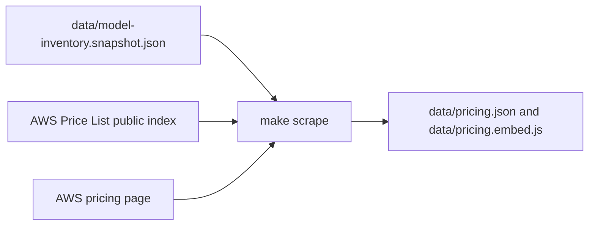

# AWS Bedrock Lens

A static tool for comparing AWS Bedrock foundation models by pricing, capabilities, and availability. No backend — all data comes from a versioned JSON file in this repo, kept up to date by a Python scraper run via GitHub Actions.

## Features

- Browse and filter models by provider, pricing type, and search
- Select multiple models and compare side-by-side
- Highlights cheapest input/output (or standard image) prices, including ties
- Shareable comparison URLs (`?models=id1,id2`)
- Staleness warning when pricing data is older than 30 days
- Full foundation-model inventory from a committed snapshot (`data/model-inventory.snapshot.json`)
- Price coverage banner — models with on-demand list prices vs catalog size
- Filter by provider, type, and whether list pricing is known
- OpenAI foundation models (`openai.gpt-oss-*`); Codex documented as a Bedrock product (not a separate `model_id`)

## Project structure

```
aws-bedrock-lens/
├── .github/workflows/
│   ├── ci.yml                 # pre-commit + schema/embed + tests
│   ├── deploy-pages.yml       # site root = app + data/
│   └── update-pricing.yml     # weekly scrape → PR (meaningful changes only)
├── app/
│   ├── index.html
│   ├── style.css
│   └── js/                    # constants, catalog, compare, browser, …
├── data/
│   ├── pricing.json
│   ├── model-inventory.snapshot.json  # Bedrock FM list (committed snapshot)
│   └── pricing.embed.js       # generated; must match JSON
├── docs/
│   └── PRICING_SOURCES.md     # HTML vs Price List API vs manual
├── schemas/pricing.schema.json
├── scraper/
│   ├── scrape.py
│   ├── validate.py
│   ├── aws_pricing_probe.py
│   └── tests/
├── scripts/
│   ├── preview-site.sh        # local production-like preview
│   └── pre-commit-validate.sh # pricing validation hook helper
└── Makefile
```

## Quick start

**Production-like preview** (site at `/`, paths `data/…`):

```bash
make preview
# open http://localhost:8080/
```

**Development** (open `app/` from repo):

```bash
python3 -m http.server 8080
# open http://localhost:8080/app/
```

`app/index.html` uses `<meta name="data-base" content="../data/">`; the deploy workflow patches this to `data/` for GitHub Pages.

## Run locally

Choose one of these local modes:

### 1) App only (fastest)

```bash
python3 -m http.server 8080
# open http://localhost:8080/app/
```

Use this when you only want to work on UI behavior with existing checked-in data.

### 2) Production-like local preview (recommended)

```bash
make preview
# open http://localhost:8080/
```

This serves the app with `data/` at the site root, matching GitHub Pages layout.

### 3) Refresh data, then run

```bash
python3 -m venv .venv && .venv/bin/pip install -r scraper/requirements.txt
make sync-models
make scrape
make validate
make preview
```

Use this when you want the latest local catalog/pricing before opening the app.

## Data & validation

```bash
python3 -m venv .venv && .venv/bin/pip install -r scraper/requirements.txt
make validate   # schema + embed in sync
make test
make sync-models          # merge inventory snapshot into pricing.json
make scrape               # inventory + Price List + HTML scrape
make scrape-all           # sync-models then scrape
make price-list           # Price List public index only
```

- `meta.last_scraped_at` — updated every successful scrape
- `meta.pricing_updated_at` — only when `on_demand` prices change
- PRs open only when prices, sources, or scrape manifest change (not scrape-only dates)
- Weekly scraping (`update-pricing.yml`) runs only against `main` (scheduled + manual dispatch on `main`)

## GitHub Pages

1. Settings → Pages → **GitHub Actions** (not “deploy from branch”).
2. Pushes to `main` — `deploy-pages.yml` publishes `app/` + `data/` to the site root (other branches are not deployed).

Live URL: `https://<user>.github.io/<repo>/` (no `/app/` path).

## Model inventory and Codex

- **Foundation models** come from `data/model-inventory.snapshot.json`, merged into the catalog with `make sync-models` (no AWS credentials).
- **OpenAI on Bedrock** includes `openai.gpt-oss-*` foundation models in the catalog. **Codex** is a coding-agent product that uses Bedrock for inference; it does not appear as its own `model_id` (see `meta.products` in `pricing.json`).
- **Coverage:** `scrape.price_coverage_pct` is the share of catalog models with any on-demand list price; inventory can be complete while many preview models lack public pricing.

## Pricing automation

Pipeline order: inventory snapshot merge → AWS Price List public index → HTML scrape. No AWS credentials. See [docs/PRICING_SOURCES.md](docs/PRICING_SOURCES.md).

- **Probe:** `make probe` or `python scraper/aws_pricing_probe.py`
- **CI:** Weekly `update-pricing.yml` uses the committed inventory snapshot and public pricing sources (no AWS secrets)

### Practical flow of scraping



1. Merge model inventory from the committed snapshot.
2. Merge on-demand pricing from the AWS Price List public index.
3. Backfill additional rows from HTML tables with literal prices.
4. Recompute coverage metrics and regenerate `pricing.embed.js`.

### Practical flow when AWS adds a new provider/model

1. **Inventory update**: when AWS publishes new models on public pages, update `data/model-inventory.snapshot.json` (manual PR) and run `make sync-models`.
2. **Merge + validate**: run `make scrape` then `make validate`.
3. **Check pricing status**:
   - If Price List/HTML contains the model, price fields are auto-populated.
   - If not, model appears with `Price unknown` until AWS publishes pricing.
4. **Only if needed**: add name mapping in `scraper/sku_overrides.json` when AWS service names do not match catalog names.
5. Commit `data/model-inventory.snapshot.json`, `data/pricing.json`, and `data/pricing.embed.js`.

## License

See [LICENSE](LICENSE).
