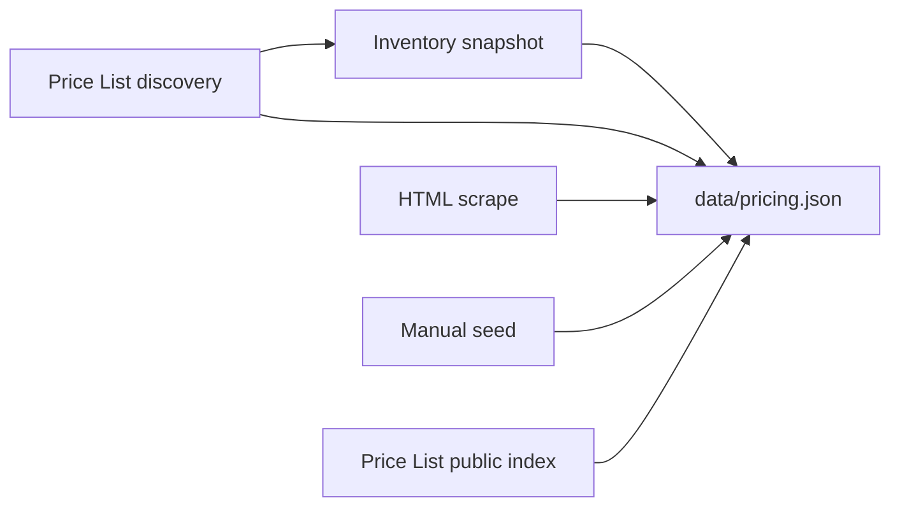

# Pricing data sources — evaluation

AWS Bedrock Lens needs **on-demand list prices** mapped to **Bedrock `model_id`** values. This document evaluates options for closing the ~90% gap where the public pricing page uses JavaScript placeholders instead of static HTML.

## Current approach: HTML scrape (`scraper/parser.py`)

| Aspect | Assessment |
|--------|------------|
| Coverage | **Low–medium** for HTML alone. Many rows parse when the catalog drives name lookup; JS placeholders still limit totals. |
| Accuracy | **High** for matched rows (same numbers as the marketing page). |
| Maintenance | Breaks when table layout changes; cheap to run weekly. |
| Auth | None required. |
| Verdict | **Keep** as a free, automated signal. Do not treat as complete. |

## Option A: Manual curation (recommended baseline)

| Aspect | Assessment |
|--------|------------|
| Coverage | **100%** of models you add to `data/pricing.json`. |
| Accuracy | Depends on reviewer; cross-check against [AWS Bedrock pricing](https://aws.amazon.com/bedrock/pricing/). |
| Maintenance | Quarterly review or when AWS announces changes. |
| Verdict | **Required** for preview models and gaps. Mark entries `pricing_source: "manual"`. |

**Process:** Review `data/pricing.json` on manual edits; weekly automation commits `pricing_source: "auto"` updates directly to `main` when prices or inventory meaningfully change.

## Model inventory: committed snapshot (`data/model-inventory.snapshot.json`)

| Aspect | Assessment |
|--------|------------|
| Coverage | **High** for foundation models listed in the snapshot file. |
| Accuracy | Depends on snapshot freshness; the scrape pipeline can append discovered models after Price List inference. |
| Maintenance | Optional manual snapshot refresh for rich metadata; weekly scrape auto-appends models discovered from Price List. |
| Auth | **None** — no `ListFoundationModels` calls in CI or default Makefile targets. |
| Verdict | **Baseline** — `make sync-models` merges the snapshot; `make scrape` also runs discovery (`scraper/model_id_inference.py` + `discover_models_from_price_list`). |

## Model discovery (Price List + HTML)

| Aspect | Assessment |
|--------|------------|
| Coverage | **Medium–high** for models AWS publishes to `AmazonBedrockFoundationModels` on-demand SKUs. |
| Accuracy | Infers `model_id` from service names via overrides, catalog names, and provider rules (e.g. `Claude Opus 4.8` → `anthropic.claude-opus-4-8`). |
| Maintenance | Extend `scraper/model_id_inference.py` when AWS introduces new naming patterns; use `sku_overrides.json` for ambiguous legacy names. |
| Verdict | **Implemented** — runs after inventory merge, before price/HTML merges; syncs new rows back into the inventory snapshot. |

## Option B: AWS Price List public index (`AmazonBedrockFoundationModels`)

Public index URL (no credentials): `https://pricing.us-east-1.amazonaws.com/offers/v1.0/aws/AmazonBedrockFoundationModels/current/us-east-1/index.json`

| Aspect | Assessment |
|--------|------------|
| Coverage | **Medium–high** for SKUs AWS publishes to the price list. On-demand token rows in the index JSON. |
| Accuracy | Official AWS catalog; [docs note](https://docs.aws.amazon.com/awsaccountbilling/latest/aboutv2/price-changes.html) marketing page wins if they disagree. |
| Maintenance | Stable index format; attribute names can shift. |
| Auth | **None** in this repo — `scraper/price_list.py` downloads the public index via HTTP (`httpx`). |
| Mapping | **Hard** — SKUs/descriptions must map to `model_id` (fuzzy string match + `sku_overrides.json`). |
| Verdict | **Implemented** in `scraper/price_list.py` (us-east-1, token on-demand). Extend `scraper/sku_overrides.json` for ambiguous names. |

**Pros:** Batch-friendly, region-aware, no headless browser.
**Cons:** Complex product JSON, not identical to Bedrock console labels, embedding/image units differ.

## Option C: Bedrock `ListFoundationModels` (API inventory)

| Aspect | Assessment |
|--------|------------|
| Coverage | Full per-region foundation model list when called live. |
| Auth | AWS credentials (Bedrock API). |
| Verdict | **Not used** in this project — inventory comes from the committed snapshot instead. |

## Option D: Bedrock `ListFoundationModelAgreementOffers`

| Aspect | Assessment |
|--------|------------|
| Coverage | Per model you call; rate cards include usage dimensions. |
| Accuracy | Contract/offer terms; good for agreement-gated models. |
| Auth | Bedrock API + often model access / marketplace agreement. |
| Mapping | `modelId` aligns with catalog — **best ID match**. |
| Verdict | **Supplement** for models already enabled in your account; poor fit for unattended CI without broad model access. |

## Option E: Headless browser scrape

| Aspect | Assessment |
|--------|------------|
| Coverage | Could match the public page after JS renders prices. |
| Accuracy | Same as user-visible page. |
| Maintenance | **Fragile** (selectors, A/B pages, runtime). |
| CI cost | Playwright/Puppeteer in GitHub Actions — slower, heavier. |
| Verdict | **Defer** unless Price List API mapping fails. |

## Recommended roadmap



1. **Now:** Snapshot merge (`sync_models.py`) + Price List **discovery** (infer `model_id`, provision catalog + snapshot) + **two** public Price List offers (`AmazonBedrockFoundationModels` + `AmazonBedrock` in `bedrock_offer.py`) + HTML scrape (with unmapped-row provisioning) + variant propagation + small `price_seeds.py` for batch-only / video SKUs + coverage UI (`price_coverage_pct`, `inventory_coverage_pct`). Entire pipeline is credential-free.
2. **Next:** Regional price dimensions beyond us-east-1; optional headless browser for `{priceOf}` placeholders if AWS stops publishing SKUs.
3. **Later:** Optional agreement-offer spot-checks if you have account access (not in CI).
4. **Never:** Imply 100% priced catalog without reporting `scrape.price_coverage_pct`.

## Probe script

Public index only (default):

```bash
make probe
# or: python scraper/aws_pricing_probe.py
```

The optional `--sample` flag calls `pricing:GetProducts` with boto3 and AWS credentials; it is for local debugging only and is not part of CI or the scrape pipeline.
