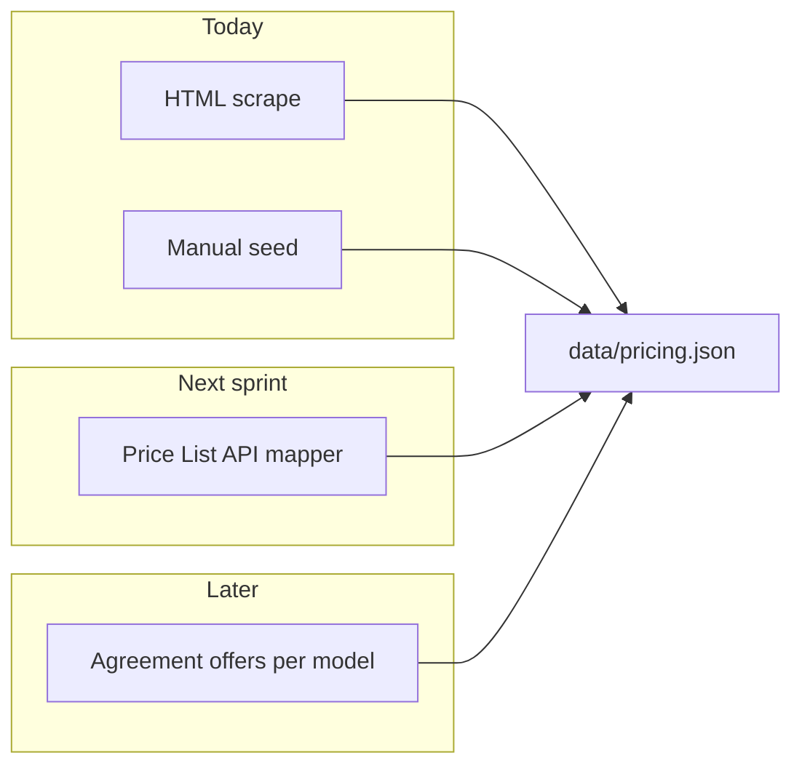

# Pricing data sources — evaluation

AWS Bedrock Lens needs **on-demand list prices** mapped to **Bedrock `model_id`** values. This document evaluates options for closing the ~90% gap where the public pricing page uses JavaScript placeholders instead of static HTML.

## Current approach: HTML scrape (`scraper/parser.py`)

| Aspect | Assessment |
|--------|------------|
| Coverage | **Low** (~5–10% of catalog today). Only tables with literal `$` in HTML parse successfully. |
| Accuracy | **High** for matched rows (same numbers as the marketing page). |
| Maintenance | Breaks when table layout changes; cheap to run weekly. |
| Auth | None required. |
| Verdict | **Keep** as a free, automated signal. Do not treat as complete. |

## Option A: Manual curation (recommended baseline)

| Aspect | Assessment |
|--------|------------|
| Coverage | **100%** of models you add to `data/pricing.json`. |
| Accuracy | Depends on reviewer; cross-check against [AWS Bedrock pricing](https://aws.amazon.com/bedrock/pricing/). |
| Maintenance | Quarterly review or when AWS announces changes. |
| Verdict | **Required** until a programmatic source covers most models. Mark entries `pricing_source: "manual"`. |

**Process:** PR review for `data/pricing.json`, use scrape PRs only to update `pricing_source: "auto"` rows.

## Option B: AWS Price List API (`pricing` service, `AmazonBedrock`)

Public endpoint: `https://api.pricing.us-east-1.amazonaws.com` (also `eu-central-1`, `ap-south-1`).

| Aspect | Assessment |
|--------|------------|
| Coverage | **Medium–high** for SKUs AWS publishes to the price list. Filter `ServiceCode=AmazonBedrock`, region, on-demand inference attributes. |
| Accuracy | Official AWS catalog; [docs note](https://docs.aws.amazon.com/awsaccountbilling/latest/aboutv2/price-changes.html) marketing page wins if they disagree. |
| Maintenance | Stable API; attribute names can shift. |
| Auth | AWS credentials (IAM) for `pricing:GetProducts`; no special Bedrock invoke permission. |
| Mapping | **Hard** — SKUs/descriptions must map to `model_id` (fuzzy string match + `NAME_TO_ID` extension). |
| Verdict | **Best next automation step.** Prototype in `scraper/aws_pricing_probe.py`. |

**Pros:** Batch-friendly, region-aware, no headless browser.
**Cons:** Complex product JSON, not identical to Bedrock console labels, embedding/image units differ.

## Option C: Bedrock `ListFoundationModelAgreementOffers`

| Aspect | Assessment |
|--------|------------|
| Coverage | Per model you call; rate cards include usage dimensions. |
| Accuracy | Contract/offer terms; good for agreement-gated models. |
| Auth | Bedrock API + often model access / marketplace agreement. |
| Mapping | `modelId` aligns with catalog — **best ID match**. |
| Verdict | **Supplement** for models already enabled in your account; poor fit for unattended CI without broad model access. |

## Option D: Headless browser scrape

| Aspect | Assessment |
|--------|------------|
| Coverage | Could match the public page after JS renders prices. |
| Accuracy | Same as user-visible page. |
| Maintenance | **Fragile** (selectors, A/B pages, runtime). |
| CI cost | Playwright/Puppeteer in GitHub Actions — slower, heavier. |
| Verdict | **Defer** unless Price List API mapping fails. |

## Recommended roadmap



1. **Now:** HTML scrape + manual curation + schema validation + coverage UI (implemented).
2. **Next:** Implement `scraper/price_list.py` using `boto3` `pricing.get_products` for `AmazonBedrock` / `us-east-1`, map to catalog, merge like HTML scrape.
3. **Later:** Optional `ListFoundationModelAgreementOffers` for validation spot-checks.
4. **Never:** Imply 100% auto coverage without reporting `scrape.coverage_pct`.

## Probe script

Run without AWS credentials (public index only):

```bash
python scraper/aws_pricing_probe.py
```

With credentials (optional, for GetProducts sample):

```bash
pip install boto3
AWS_PROFILE=your-profile python scraper/aws_pricing_probe.py --sample
```
